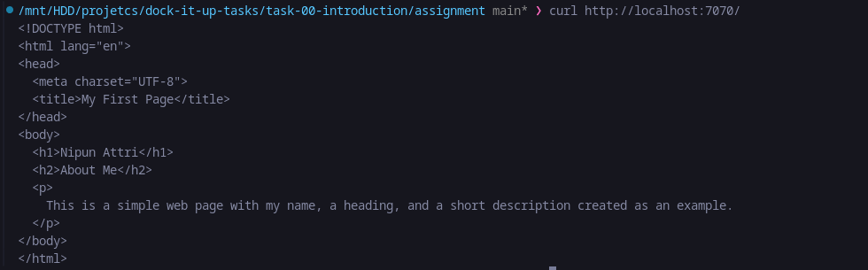
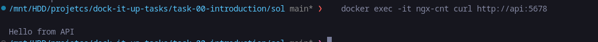

# Solution to task 00 (introduction)
## PART 1
### build using
```
docker build -t nipun-site .
```

### Run Using

```
docker run -d --name website -p 7070:80 nipun-site
```

### testing 
```
curl http://localhost:7070/
```

#### Output

## PART 2

### create network
```
docker network create webnet
```
### Run nginx container on that network
```
docker build -t ngx .
docker run -d --name ngx-cnt -p 8080:80 --network webnet ngx
```

### Run and test the webserver
```
docker run -d --name api --network webnet hashicorp/http-echo -text="Hello from API"
```

#### Output
